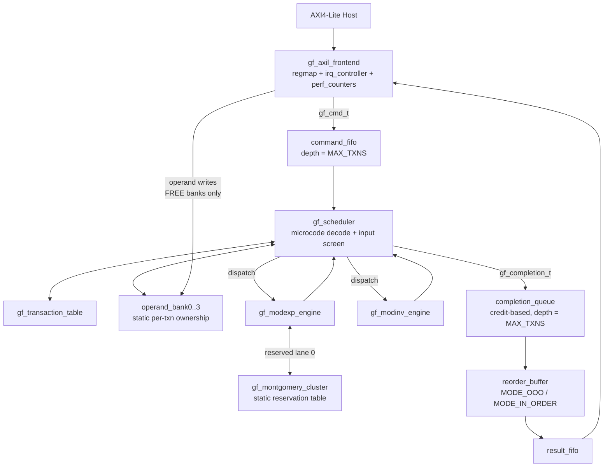

# GSAF Architecture — As Implemented (V5.1)

This document describes the implemented microarchitecture and records every
deliberate deviation from the V5 draft spec (each one is a correction, not an
omission).

## Block diagram



## Constant-time contract

| Block | Latency | Data dependence |
|---|---|---|
| `gf_mont_mult` | exactly `WIDTH + 2` cycles | none — fixed iteration count, final subtract computed unconditionally and muxed |
| `gf_modexp_engine` | `2·WIDTH` doublings + `(16 + 5·WIDTH/4 + 2)` multiplies | none — every window does 4 squarings + 1 multiply, **including digit 0** |
| `gf_modinv_engine` | exactly `DIVSTEP_BOUND` iterations + 2 cycles | none — both divstep branches computed each cycle, mux-selected |

`DIVSTEP_BOUND = ⌊(49d+80)/17⌋ (d<46), ⌊(49d+57)/17⌋ (d≥46)` — the
machine-checked Bernstein–Yang bound (validated empirically in
`model/golden_model.py` self-test). Never `2·WIDTH`.

**No `*`, `/`, `%` exists in any RTL datapath.** (Constant-index part-select
addressing and TB-only reference code are exempt.)

## Contention freedom — by construction, not by arbitration

- **Operand banks:** one bank ↔ one transaction for its entire lifetime. Host
  writes only FREE banks (frontend drops writes to busy banks); exactly one
  engine reads the bank; completion logic writes RESULT once. No cycle ever
  has two requestors on one bank ⇒ no arbiter exists ⇒ nothing to leak.
- **Multiplier lanes:** `gf_montgomery_cluster` lane *k* is hard-wired to
  engine *k* at elaboration. There is no datapath by which another engine can
  reach the lane — "no mid-transaction stealing" is structural, not a rule.
- **Completion collector:** fixed-priority serializer on the *control* path
  only; it can delay completion *reporting* but never the arithmetic latency
  of any in-flight operation.

## Backpressure firewall

Engines hand results to the scheduler's completion collector; from there:
`completion_queue → reorder_buffer → result_fifo → AXI`. A host that never
reads stalls `result_fifo`; the completion queue (depth = MAX_TXNS,
credit-based) still absorbs every outstanding completion, so engine pipelines
never observe host backpressure.

## Engine Interface Contract (`gf_engine_if.sv`)

The formally specified interface between the chassis and pluggable engines.
Engines implement this interface; the chassis consumes it. Formal verification
proves each side independently.

### Interface Signals

| Signal | Direction | Description |
|--------|-----------|-------------|
| `cmd_valid` | chassis → engine | Command valid |
| `cmd_ready` | engine → chassis | Engine ready to accept command |
| `cmd_opcode` | chassis → engine | Operation code (OP_MODEXP, OP_MODINV, etc.) |
| `cmd_txn_id` | chassis → engine | Transaction identifier |
| `cmd_base` | chassis → engine | Base operand (ModExp) or `a` (ModInv) |
| `cmd_exp` | chassis → engine | Exponent (ModExp), unused for ModInv |
| `cmd_m` | chassis → engine | Modulus |
| `rsp_valid` | engine → chassis | Result valid |
| `rsp_ready` | chassis → engine | Chassis ready to accept result |
| `rsp_result` | engine → chassis | Computed result |
| `rsp_status` | engine → chassis | Status code (OK, INVALID_INPUT, etc.) |
| `rsp_txn_id` | engine → chassis | Transaction identifier (echoed) |
| `engine_idle` | engine → chassis | Engine is in IDLE state |

### Security Properties (SVA)

| Property | Description |
|----------|-------------|
| P_E1 | **Eventual response**: command accepted → result produced within bounded cycles |
| P_E2 | **Legal status**: every response carries a valid status code |
| P_E3 | **Backpressure immunity**: engine completes regardless of result read timing |
| P_E4 | **One-at-a-time**: only one command processed at a time |
| P_E5 | **Valid/ready protocol**: standard handshaking, no combinational loops |

### Wrapper Modules

Existing engines are NOT modified. Lightweight wrapper modules adapt the
engine ports to the interface:

- `gf_modexp_engine_wrapper.sv` — adapts gf_modexp_engine
- `gf_modinv_engine_wrapper.sv` — adapts gf_modinv_engine

## Dyno Test Harnesses

A "dyno" is a minimal test harness that mimics the chassis — it connects to
a single engine through `gf_engine_if.sv` and verifies the engine in isolation.

### Structure

```
tb/dynos/
├── dyno_common.py       # Shared infrastructure (clock, reset, driver, collector)
├── dyno_modexp.py       # ModExp engine tests
├── dyno_modinv.py       # ModInv engine tests
├── tb_dyno_modexp.sv    # SV wrapper for cocotb
├── tb_dyno_modinv.sv    # SV wrapper for cocotb
└── Makefile             # cocotb simulation
```

### Key Principle

Each engine is verified on its own dyno. The chassis is verified against the
same interface spec. Integration correctness is proven by the formal interface
properties, not by re-simulating the full system.

## Deviations from the V5 draft (all intentional)

| # | Draft said | Implemented | Why |
|---|---|---|---|
| 1 | `MULT_LATENCY = 16` | `MULT_LATENCY = WIDTH + 2` (derived) | a fixed 16 is only valid at one operating point; latency necessarily scales with width |
| 2 | Radix-4 carry-save multiplier | Radix-2 bit-serial (v1) | correctness and provability first; radix-4 CSA is a drop-in perf upgrade behind the same lane interface (roadmap item, ~4× throughput) |
| 3 | "Completion queue overflow" as UVM coverage | Overflow made *impossible* (depth = MAX_TXNS) + SVA proof obligation | design the failure out instead of testing for it |
| 4 | Bank/requestor mapping unspecified | Static bank-per-transaction ownership | the only scheme that satisfies "no engine shall stall" without an arbiter |
| 5 | (absent) | Secure wipe of operand banks, exponent register, multiplier residue, divstep cofactors on retire/reset | operands are key material; zeroization is table stakes for cert |
| 6 | (absent) | Frontend drops host writes to non-FREE banks | transaction isolation against a buggy/hostile driver |

## Parameters

| Parameter | Default | Range |
|---|---|---|
| `WIDTH` | 64 (sim) | 8/16 (formal), 256–4096 (production) |
| `NUM_OPERAND_BANKS` / `MAX_TXNS` | 4 | scales together |
| `WINDOW_SIZE` | 4 | fixed-window modexp |
| `NUM_MULTIPLIERS` | 1 | 1–8, one lane per multiplier-using engine |
| `RESPONSE_ORDERING` | `MODE_OOO` | `MODE_OOO` / `MODE_IN_ORDER` |
| `DIVSTEP_BOUND` | derived | proof bound, see above |

## Register map (AXI4-Lite)

See header of [rtl/gf_axil_frontend.sv](../rtl/gf_axil_frontend.sv). Driver flow:

1. Poll `STATUS.bank_free`, pick a free bank *b*
2. Write operands A/B/M into bank window `0x100 + b·0x40`
3. Write `CMD = {bank, opcode, txn_id}`
4. On IRQ or poll: read `RESP` (peek), read `RESULT` words from bank window
5. Write `RESP_POP = 1` → pops, retires, **wipes the bank**

## Security countermeasures (status)

**Shipped in this revision:**

1. **Exponent blinding (DPA):** the exponent datapath is
   `EXP_W = WIDTH + EXP_BLIND_BITS` (default +64) bits wide; hosts submit
   `d' = d + k·λ(m)` with fresh random `k` per operation. Identical result,
   randomized power signature. Operand region B and the AXI window are
   widened accordingly (regmap supports `EXP_W ≤ 128`; wider needs v2 stride).
   Math machine-verified in `model/golden_model.py`.
2. **Message blinding (DPA):** host-side blind/unblind flow
   (`x_b = x·r^e`, `s = s_b·r^{-1}`) verified in the golden model; the fabric
   only ever sees blinded messages. Driver collateral documents the flow.
3. **Fault detection:** sparse Hamming-distance-3 FSM encodings in
   `gf_modexp_engine` — any glitched state value traps to `DONE` with
   `STATUS_FAULT`; result range check (`result < m`) on ModExp; divstep
   termination check (`g == 0` at proof bound) on ModInv. Faults are always
   *reported*, never silent.

**Remaining roadmap (required before full "production-intent" claims):**

1. TVLA leakage campaign on FPGA captures (program: VERIFICATION_PLAN.md).
2. First-order masking evaluation on the multiplier datapath.
3. **RSA-CRT engine** with Bellcore-attack hardening (verify-after-sign).
4. **PQC engines** (ML-KEM / ML-DSA) on reserved slots — math already modeled
   and verified in `model/pqc_ntt_model.py`; NTT butterflies map to the same
   reserved-lane resource class as Montgomery multipliers, so the scheduler
   and isolation model are unchanged. Primary commercial driver, see
   [GTM.md](GTM.md).
